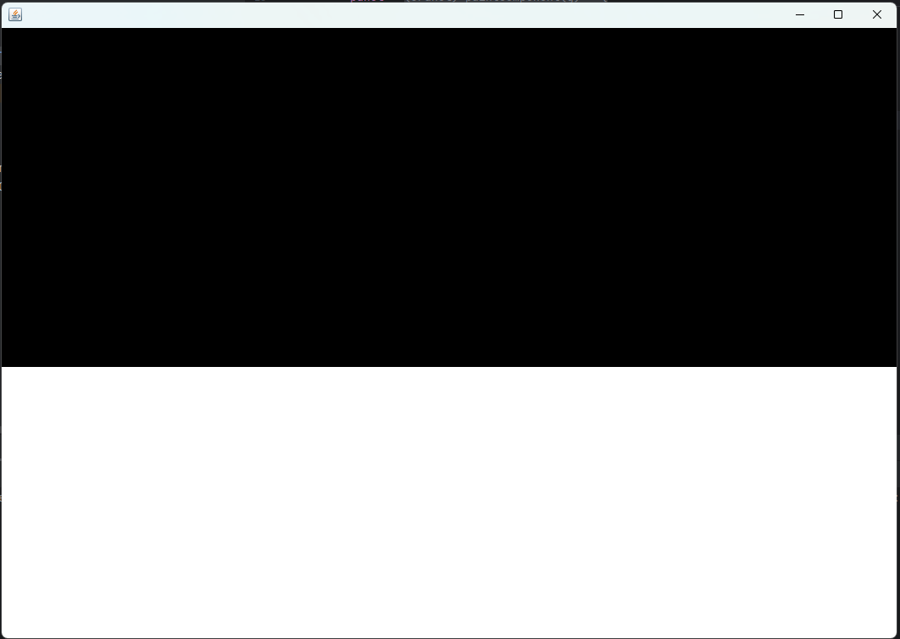

#JAVA #Proiektua
## Primer Dia 16/04/2024

### Parte 1 Testing de concepto y planificacion

Primero he utilizando draw io he echo un esquema uml de mi proyecto java


En este esquema he pensado en un "motor de videjuegos" que funciona en base a una matriz de dos dimensiones ya que el juego que haremos solo tine dos dimensiones.

Despues de hacer un esquema he hecho pruebas de como puedo pintar pixeles en un JFrame en java, haciendo test al final me a quedado este codigo:

```java
import javax.swing.*;
import java.awt.*;

public class ConceptTest {
    private static final int X_CANVAS_SIZE = 1056;
    private static final int Y_CANVAS_SIZE = 720;
    private static final int X_GRID_SIZE = 66;
    private static final int Y_GRID_SIZE = 45;
    private static final int CELL_SIZE = 16;

    private int[][] matrix = new int[X_GRID_SIZE][Y_GRID_SIZE];
    private JPanel panel;

    private JFrame frame;

    public ConceptTest() {
        frame = new JFrame();
        panel = new JPanel() {
            @Override
            protected void paintComponent(Graphics g) {
                super.paintComponent(g);
                for (int i = 0; i < X_GRID_SIZE; i++) {
                    for (int j = 0; j < Y_GRID_SIZE; j++) {
                        int x = i * CELL_SIZE;
                        int y = j * CELL_SIZE;
                        if (matrix[i][j] == 1) {
                            g.setColor(Color.BLACK);
                            g.fillRect(x, y, CELL_SIZE, CELL_SIZE);
                        } else {
                            g.setColor(Color.WHITE);
                            g.fillRect(x, y, CELL_SIZE, CELL_SIZE);
                        }
                    }
                }
            }
        };
        panel.setPreferredSize(new Dimension(X_CANVAS_SIZE, Y_CANVAS_SIZE));
        frame.add(panel);
        frame.pack();
        frame.setDefaultCloseOperation(JFrame.EXIT_ON_CLOSE);
        frame.setVisible(true);
        // For para rellenar la matriz con datos solo para testing
        for (int i = 0; i < X_GRID_SIZE; i++) {
            for (int j = 0; j < 25; j++) {
                matrix[i][j] = 1;
            }
        }
    }

    public void render() {
        panel.repaint();
    }

    public void updateMatrix(int[][] newMatrix) {
        this.matrix = newMatrix;
        render();
    }

    public static void main(String[] args) {
        SwingUtilities.invokeLater(() -> {
            ConceptTest a = new ConceptTest();
            a.render();
        });
    }
}

```

#### Varibles

Esta clase primero tiene las siguientes constates y variables para poder definir nuestra venta:
- X_CANVAS_SIZE: en esta constante definimos lo ancho que queremos que sea nuestra interfaz del juego.

- Y_CANVAS_SIZE: en esta constante definiremos lo alto que queremos que sea nuestra interfaz.

- X_GRID_SIZE : en esta constate definiremos cuantos "cuadrados" de ancho queremos que sea nuestro interfaz.

- Y_GRID_SIZE: en esta constate definiremos cuantos "cuadrados" de alto queremos que sea nuestra interfaz.

- CELL_SIZE: en esta constante definiremos cuanto ocupa cada "cuadrado" en la intefaz.

- matrix : esta sera la matriz encargada de manejar el juego, en esta guardaremos la posicion de todos los objetos dentro del juego, este tendrá como tamaño los valores de la altura y anchura maxima que hemos definido antes luego explícare mas en detalle como funcionara.

- panel: este es el panel que mostrara todos los datos del juego.

#### Sistema de Matriz bidimensional

Como he mencionado antes en este caso voy a utilizar u sistema basado en una matriz para poder guardar los datos sobre la partida, en este caso tenemos una matriz de 66x45 que corresponde al x16 de nuestro panel, por eso cada posicion de la matriz ocupara un espacio de 16x16 picxeles en nuestro panel.

Este sistema podeis modificarlo cambiando los valores de la constaten a vuestro gusto, por ejemplo si quereis que cada posicion el la matriz corresponda a 8x8 pixeles tendrias que cambiar el CELL_SIZE a 8 y duplicar los valores X_GRID_SIZE e Y_GRID_SIZE ya que si haceis 90x8 os da 720 que en este caso seria la altura del panel.

```java
    private static final int X_CANVAS_SIZE = 1056;
    private static final int Y_CANVAS_SIZE = 720;
    private static final int X_GRID_SIZE = 122;
    private static final int Y_GRID_SIZE = 90;
    private static final int CELL_SIZE = 8;
```

#### Renderizado del juego

Siguendo con la aplicacion segiremos con el panel donde cambiaremos su metodo paintComponent, este metodo se encarga de pintar el panel pero en nuestro caso lo canbiaremos por un for anidado que este recorrera cada poscion de la matrix en este caso si la posicion corresponde al valor 1 el "cuadrado" se pintara de negro si no de blanco.

```java
panel = new JPanel() {
            @Override
            protected void paintComponent(Graphics g) {
                super.paintComponent(g);
                for (int i = 0; i < X_GRID_SIZE; i++) {
                    for (int j = 0; j < Y_GRID_SIZE; j++) {
                        int x = i * CELL_SIZE;
                        int y = j * CELL_SIZE;
                        if (matrix[i][j] == 1) {
                            g.setColor(Color.BLACK);
                            g.fillRect(x, y, CELL_SIZE, CELL_SIZE);
                        } else {
                            g.setColor(Color.WHITE);
                            g.fillRect(x, y, CELL_SIZE, CELL_SIZE);
                        }
                    }
                }
            }
        };
```

luego tenemos los metodo render y updatematrix, el primero le llama a la funcion modificada del panel el repaint y el segundo recive como argumeto una matriz modificada y este se intercambia por la vieja matriz y repinta el panel.

Al final en el metodo main pondremos esto:

```java
public static void main(String[] args) {
        SwingUtilities.invokeLater(() -> {
            ConceptTest a = new ConceptTest();
            a.render();
        });
    }
```

Este codigo se ejecuta en un trhead especial que se utiliza para renderizar objetos de java Swing, en esta primero crearemos un uevo objeto de este tipo y ejecutaremos la funcion render.

#### Testing de la aplicacion

En este test para poder probar si el render funcionaba bien en el contructo he añadido un for para llenar de numeros la matriz, donde el numero de segundo for es la funcion :

```java
for (int i = 0; i < X_GRID_SIZE; i++) {
            for (int j = 0; j < 25; j++) {
                matrix[i][j] = 1;
            }
        }
```

Si lo habeis hecho bien os deveria de aparecer Un panel con la mita de los pixeles en negro




### Parte 2 Sistema de renderizado de Sprites

Como ya tenemos un sistema que renderiza nuestros pixeles en este caso vamos a poner un sistema que renderizara sprites de 16x16, para eso vamos a crea un Enum con el nombre Formak
En esta guardaremos el caracter de "cuadrado" y la imagen, para eso empezaramos Creando la clase formak.

A la clase ConceptTest vamos a cambiarle el nombre a Graficos y vamos a meterlo en un nuevo package llamado render, luego crearemos otro package diferente llamado data y en esta crearemos el Enum Formak con este codigo:

Primero vamos a crear un Un statico llamdo "WALL" en nuestro enum, y este va tener su valor ascii y la ruta al sprite que queramos tener, y luego en el constructo tendermos el metodo que caraga la imagen a la clase:


```java
package data;  
  
import javax.imageio.ImageIO;  
import java.awt.*;  
import java.awt.image.BufferedImage;  
import java.io.File;  
import java.io.IOException;  
  
public enum Formak {  
    WALL('#', "assets/pareta.png"),  
    ;  
    private final char symbol;  
    private final Image irudia;  
  
    Formak(char symbol, String irudia) {  
        this.symbol = symbol;  
        BufferedImage image;  
        try {  
            image = image = ImageIO.read(new File(irudia));  
            this.irudia = image;  
        } catch (IOException e) {  
            throw  new RuntimeException("Irudia ezin da kargatu: " + irudia);  
        }  
    }  
  
    public char getSymbol() {  
        return symbol;  
    }  
  
    public Image getIrudia() {  
        return irudia;  
    }  
}
```

En mi caso he creado una carpeta con las imagenes que voy a utilizar vosotros podeis utilizar los que querais simpre que sean de 16x16 en mi caso para hacer pruebas he utilizado eta imagen de este muro -> 

Ahora vamos a hacer cambios de nuestra clase de Grafios, en esta vamos a canviar la matriz de eentero por una matriz de Formak y el metodo de repaint vamos a hacer que obtenga la imagen de esta y lo ponga en uestro "cuadrado".

```java
package render;  
  
import data.Formak;  
  
import javax.swing.*;  
import java.awt.*;  
  
public class Graficos {  
  
    private static final int X_CANVAS_SIZE = 1056;  
    private static final int Y_CANVAS_SIZE = 720;  
    private static final int X_GRID_SIZE = 66;  
    private static final int Y_GRID_SIZE = 45;  
    private static final int CELL_SIZE = 16;  
  
    private Formak[][] matrix = new Formak[X_GRID_SIZE][Y_GRID_SIZE];  
  
    private JPanel panel;  
  
    public Graficos() {  
        JFrame frame = new JFrame();  
        panel = new JPanel() {  
            @Override  
            protected void paintComponent(Graphics g) {  
                super.paintComponent(g);  
                for (int i = 0; i < X_GRID_SIZE; i++) {  
                    for (int j = 0; j < Y_GRID_SIZE; j++) {  
                        int x = i * CELL_SIZE;  
                        int y = j * CELL_SIZE;  
                        if (matrix[i][j] != null) {  
                            g.drawImage(matrix[i][j].getIrudia(), x, y, CELL_SIZE, CELL_SIZE, this);  
                        } else {  
                            g.setColor(Color.BLACK);  
                            g.fillRect(x, y, CELL_SIZE, CELL_SIZE);  
                        }  
                    }  
                }  
            }  
        };  
        panel.setPreferredSize(new Dimension(X_CANVAS_SIZE, Y_CANVAS_SIZE));  
        frame.add(panel);  
        frame.pack();  
        frame.setDefaultCloseOperation(JFrame.EXIT_ON_CLOSE);  
        frame.setVisible(true);  
        // For para rellenar la matriz con datos solo para testing
        for (int i = 0; i < X_GRID_SIZE; i++) {  
            for (int j = 0; j < 15; j++) {  
                matrix[i][j] = Formak.WALL;  
            }  
        }  
    }  
  
    public void render() {  
        panel.repaint();  
    }  
  
    public void updateMatrix(Formak[][] newMatrix) {  
        this.matrix = newMatrix;  
        render();  
    }  
}
```

Para terminar vamos a crear la clase Main que se encargara de inicializar nuestra clase:

```java
import render.Graficos;  
  
public class Main {  
    public static void main(String[] args) {  
     Graficos a = new Graficos();  
     a.render();  
    }  
}
```

Si hemos hecho todo bien nos deberia de aparecer esto en el panel


## Segundo Dia 17/04/2024

### Parte 1 empezamos con la creacion del "Engine" del juego

La base de nuestro juego estara en tres objetos el primero el GameObject que seran todos los objetos que se muestren en pantalla el segundo la clase Vector2 que es una clase muy simple solo para administrar las cordenadas y la ultima la clase Ui que sera el encargado de montrar los datos dentro del juego.

Empecemos por la clase Vector2 esta clase se encargaar de administrar nuestras cordenas de la matriz y asegurase de que estoas no esten fuera de este. Primero iremos a la clase Graficos y haremos que el X e Y grid size sena publicon para poder utilizarlos en otras clases y crearemos la clase Vector2, en mi caso voy a anadir una Excpetion personalizada para saber Cuando tengo errores por la culpa de la posicion.

Este es el codigo que utilizaremos para la la clase Vector2:

```java
package data;  
  
import render.Graficos;  
  
    private int x;  
    private int y;  
  
    public Vector2(int x, int y) throws GameLogicException{  
        setX(x);  
        setY(y);  
    }  
  
    public int getX() {  
        return x;  
    }  
  
    public int getY() {  
        return y;  
    }  
  
     public void setX(int x) throws GameLogicException {  
        if (x < Graficos.X_GRID_SIZE) {  
            this.x = x;  
        } else {  
        // aqui podeis canbiar la excepcion que lanza por la que querais
            throw new GameLogicException("Posizioa ezin da tablerotik atera. x=" + x );  
        }  
    }  
  
    public void setY(int y) throws GameLogicException {  
        if (y < Graficos.Y_GRID_SIZE) {  
            this.y = y;  
        } else {  
        // aqui podeis canbiar la excepcion que lanza por la que querais
            throw new GameLogicException("Posizioa ezin da tablerotik atera. y=" + y );  
        }  
    }  
}
```

Ahora crearemos el primer Objeto del juego llamado Estatikoa este objeto como elnombre indica se refiere a Objeto estaticos tales como paredes suelos y lo de mas y por ahora tendra esta forma:

```java
package data;  
  
public class Estatikoa extends GameObject{  
  
    public Estatikoa(Formak forma, Vector2 posizioa) {  
        super(forma, posizioa);  
    }  
  
    @Override  
    void update() {  
        // TODO Auto-generated method stub  
    }  
}
```

Ahora vamos a canbiar el tipo de matriz de nuestra clase Graficos de Formak a GameObject y para eso haremos esto:

```java
private GameObject[][] matrix = new GameObject[X_GRID_SIZE][Y_GRID_SIZE];  
  
private JPanel panel;  
  
public Graficos() throws GameLogicException {  
    JFrame frame = new JFrame();  
    panel = new JPanel() {  
        @Override  
        protected void paintComponent(Graphics g) {  
            super.paintComponent(g);  
            for (int i = 0; i < X_GRID_SIZE; i++) {  
                for (int j = 0; j < Y_GRID_SIZE; j++) {  
                    int x = i * CELL_SIZE;  
                    int y = j * CELL_SIZE;  
                    if (matrix[i][j] != null) {  
                        g.drawImage(matrix[i][j].getForma().getIrudia(), x, y, CELL_SIZE, CELL_SIZE, this);  
                    } else {  
                        g.setColor(Color.BLACK);  
                        g.fillRect(x, y, CELL_SIZE, CELL_SIZE);  
                    }  
                }  
            }  
        }  
    };  
    panel.setPreferredSize(new Dimension(X_CANVAS_SIZE, Y_CANVAS_SIZE));  
    frame.add(panel);  
    frame.pack();  
    frame.setDefaultCloseOperation(JFrame.EXIT_ON_CLOSE);  
    frame.setVisible(true);  
    // Este es el metodo de test actulizado para que funcione con la nueva matriz
    for (int i = 0; i < X_GRID_SIZE; i++) {  
        for (int j = 0; j < 25; j++) {  
           if ((j + i) % 2 == 0) {  
               matrix[i][j] = new Estatikoa(Formak.WALL, new Vector2(i, j));  
           }  
        }  
    }  
}
```

Luego siguiendo  el esquema de draw io crearemos todas la clases que aparecezen en todos los paquetes, aqui os dejo el link al commit que para que os descargeis las clases [Enlace](https://github.com/hruiz-dev/ASCII-Dungeon/archive/e0fff33e81f8efc4aea29bcec74566bd02e83a75.zip).

## Dia tres 19/04/2024

Lo que he hecho:

- GameKeyListener klasea sortu eta implementatu
- Canviar sistema a un sistema de layers para poder paratar lo reactivo de lo que no es reactivo

